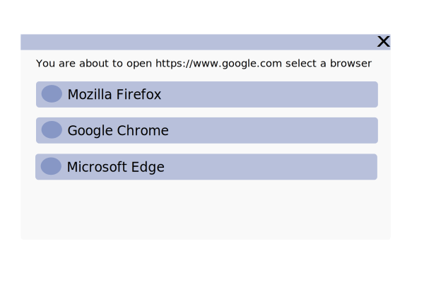

# Browser Selector
Choose the browser you will run any time a link is opened from a click or any other action.

# Requirements for first release
- As a user I:
  - start the program and be guided to set it as default OS browser
  - click a link and instead of a browser opening I see the program showing a list of browsers 
  - select browsers from the list by using my keyboard arrows or the mouse scroll wheel
  - don't have to manually focus the window
  - will always see the window on top of anything else
  - can get rid of the window if I either: hit ESC, click somewhere else
  - only the use program on Windows
  - benefit from a performant operation taking at most 300msec for the window to come up on screen when I use an SSD as my system drive
  - see list ordered by how often I use a certain browser

  UI Mockup     
  

# Future roadmap
- Allow manual drag and drop reordering of the list
- Support multiple Firefox profiles

# Far future roadmap
- Add support for Linux and MacOS
- Add learning algorithm that predicts the choice made by looking at: time of the day, location of the device, program from where the link was clicked

### Resources for future implementations
https://stackoverflow.com/questions/62107050/how-can-i-create-a-messagedialog-using-winrt-rs
https://blogs.windows.com/windowsdeveloper/2019/04/30/enhancing-non-packaged-desktop-apps-using-windows-runtime-components/