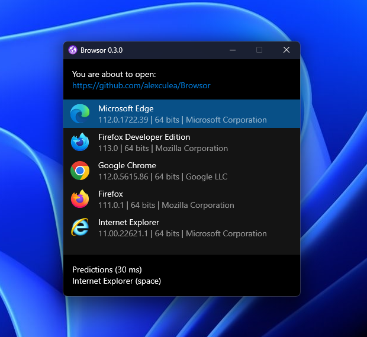

# Browser Selector - desktop app for Windows 10

A tool that registers as the default system browser prompting you to select one of the installed ones to open the URL. Works whenever you open a link from any desktop app.

## Screenshot
  

## Use cases
- Privacy
  - Open a new browser or browser profile depending on the imediate context
  - Potentially reduce online tracker finger printing accuracy by alternating browsers
- Testing
  - Test different browser versions, betas, development, etc
- Flexibility
  - Choose everytime based on what web apps are known to work best on, such as Google services in Chrome
  - Use multiple browser profiles on the fly, eg: work vs personal

